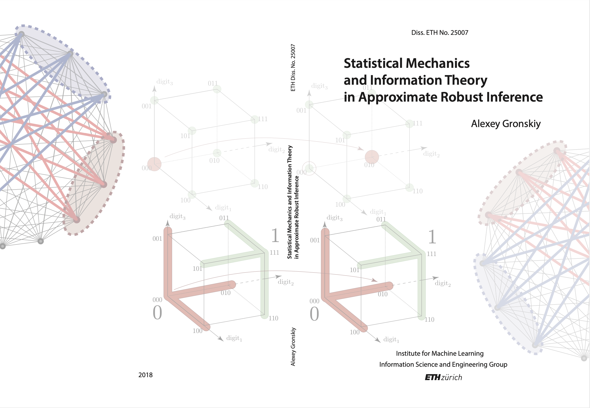
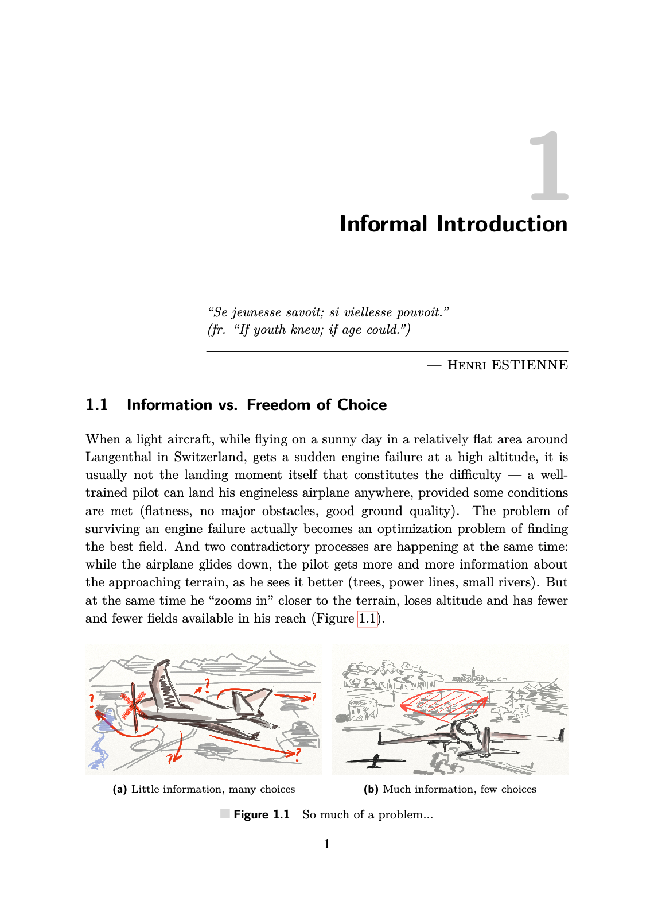
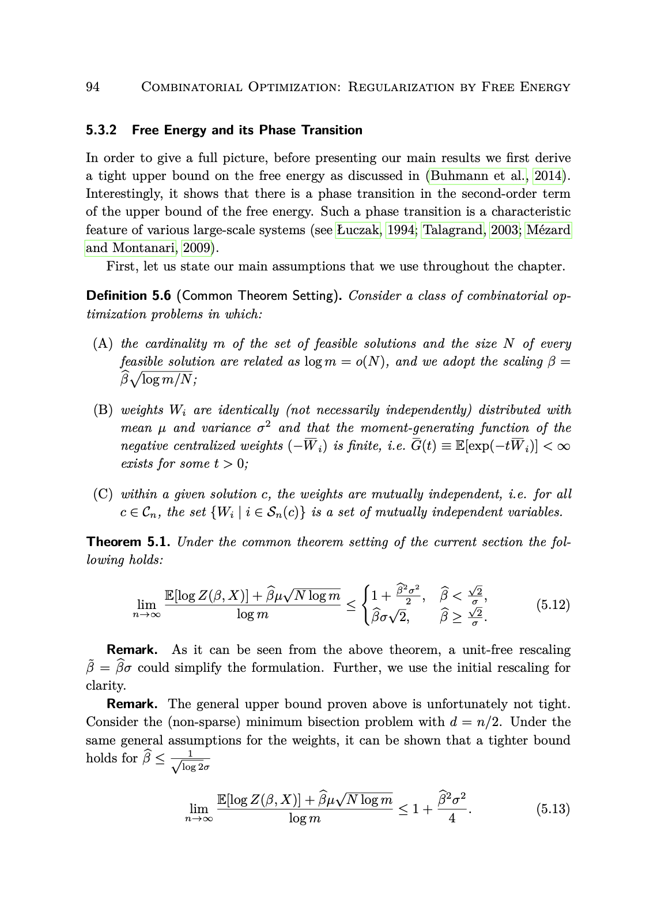
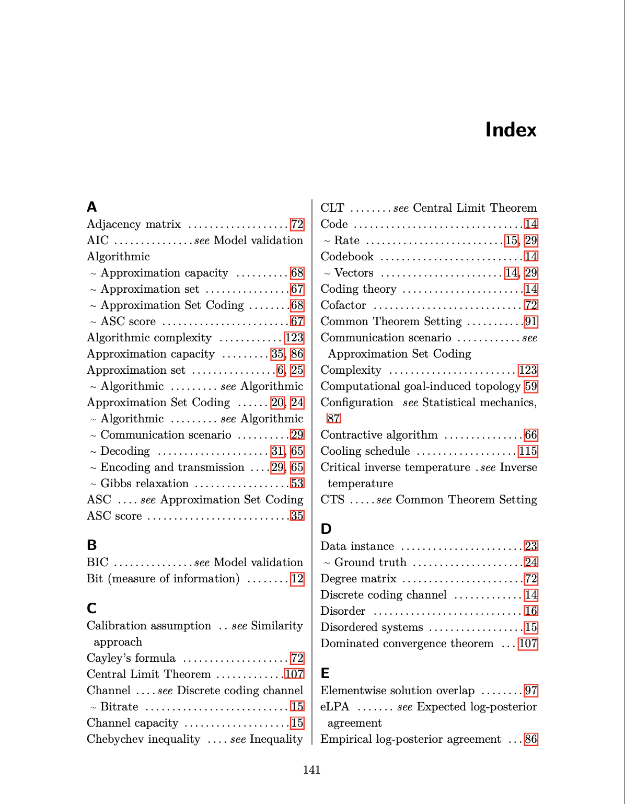
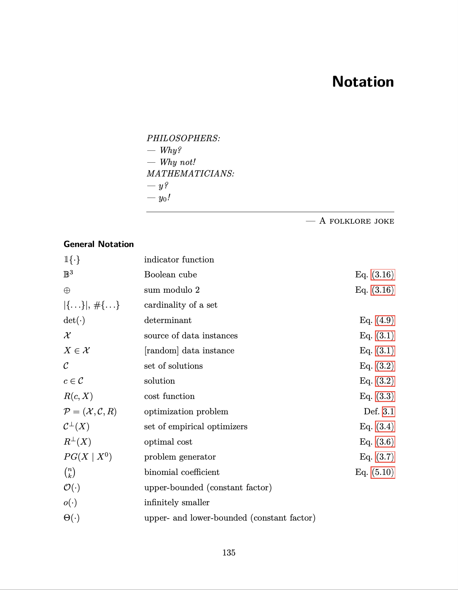
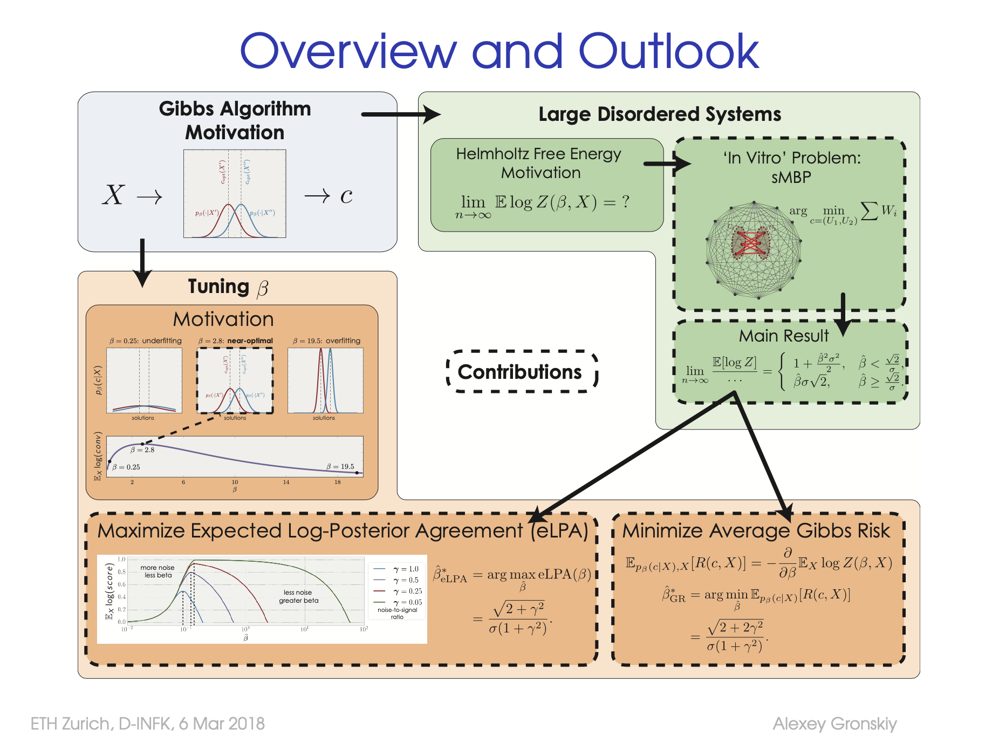
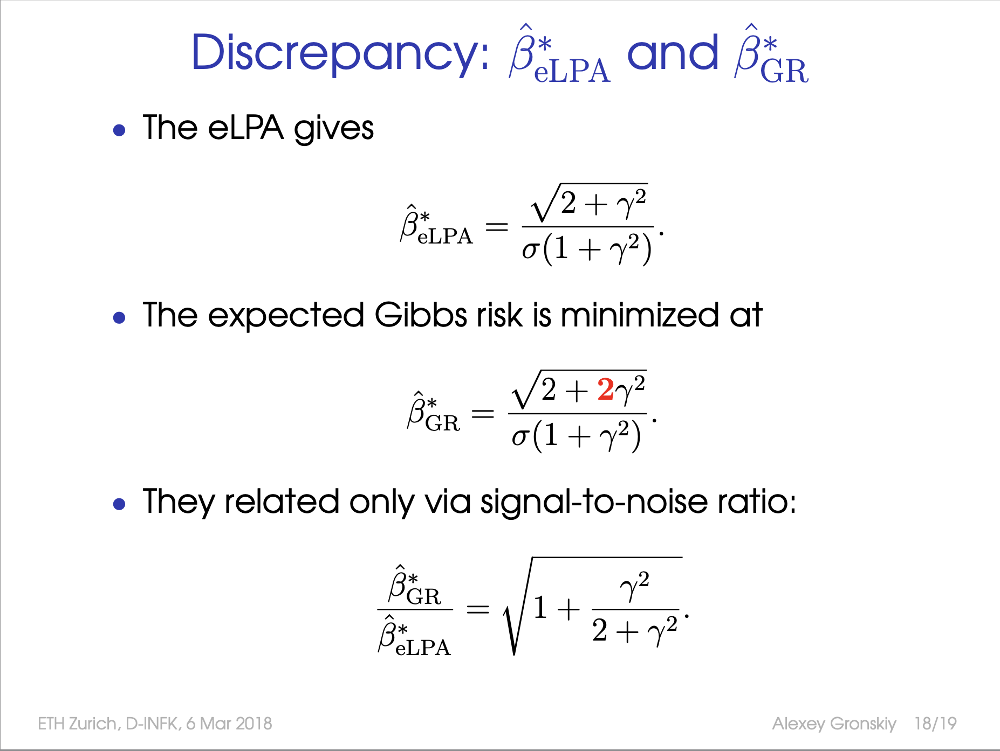

# Thesis and presentation 

Useful if you like the TeX style. Disclaimer: completely unredacted, feel free to contact me
if needed.

- [Thesis](https://gron.sk/thesis)
- [Presentation](https://gronskiy.com/assets/files/gronskiy_phd_talk.pdf)

Examples of visual elements below.

## Thesis TeX visual elements

## Presentation visual elements

